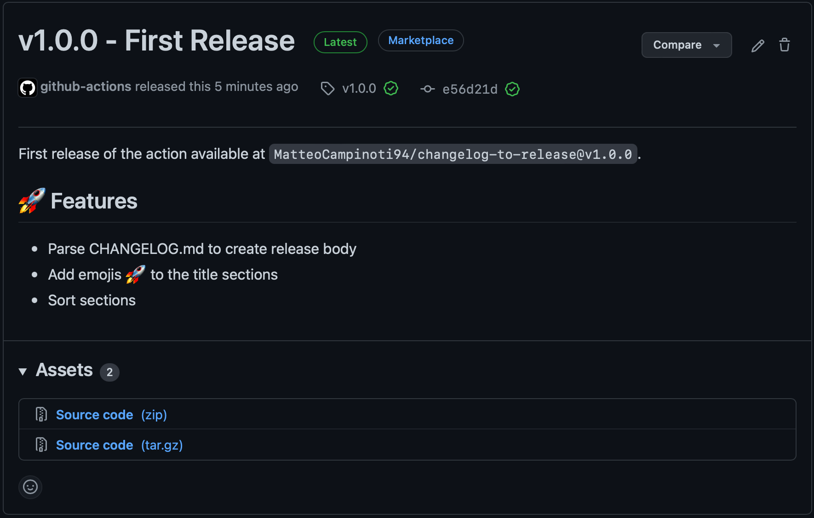

# Changelog to Release Action

> **Note:** This action is based on the excellent work by [@MatteoCampinoti94](https://github.com/MatteoCampinoti94)
> and his [changelog-to-release](https://github.com/MatteoCampinoti94/changelog-to-release) action.
> This version has been adapted and enhanced to be part of the [lipkau/gh-tools](https://github.com/lipkau/gh-tools)
> collection.

This action converts version entries from CHANGELOG.md into release notes.
It allows to automatically sort sections and add emojis for each release following a single standard.

## Changelog Format

The changelog is parsed by header. For this action to work,
the changelog must follow a specific header format:

* Level 1 headers are ignored.
* Level 2 headers identify the version entry.
  The version must follow the header token directly, and any further title must be separated by at
  least a space.
  > `## {version} {extra title}`
* Unlabelled text under level 2 headers (before any level 3 header) is added at the top of the
  generated release body.
* Level 3 headers identify the main sections of the version entry.
  The default configuration uses some common titles ( changes, fixes, etc.),
  but these can be easily overridden with the `configuration` input.
  > `### {section title}`
* Level 4 headers and beyond are considered part of their parent sections and are not processed.

## Configuration

The configuration uses three fields:

* `emojisPrefix: boolean` controls whether the emojis should be added before (`true` or unset)
  or after (`false`) the section title.
* `emojis: {[section: string]: string}` controls which emoji should be used for a section
* `order: string[]` controls how the sections should be sorted.
  Sections not in the `order` list will be sorted as they appear in the changelog.

```json
{
  "emojisPrefix": true,
  "emojis": {
    "changes": "⚙️",
    "dependencies": "📦",
    "distribution": "🚚",
    "features": "🚀",
    "new features": "🚀",
    "fixes": "🔧",
    "links": "🔗",
    "notes": "📝",
    "other": "💬",
    "security": "🛡"
  },
  "order": [
    "new features",
    "features",
    "changes",
    "fixes",
    "security",
    "dependencies",
    "distribution",
    "notes",
    "other",
    "links"
  ]
}
```

## Inputs

| Input           | Explanation                                     | Default                |
| --------------- | ----------------------------------------------- | ---------------------- |
| `version-name`  | The version to search in the changelog file     | None, required         |
| `changelog`     | Path to changelog file from repository root     | `CHANGELOG.md`         |
| `configuration` | Path to configuration file from repository root | Built in configuration |

## Outputs

| Output  | Explanation                             |
| ------- | --------------------------------------- |
| `title` | Release title as found in the changelog |
| `body`  | Formatted release body                  |

## Usage

### Pinned Version (Recommended for Production)

```yaml
uses: lipkau/gh-tools/actions/changelog-to-release@changelog-to-release/v1.1.0
```

### Major Version (Auto-updates)

```yaml
uses: lipkau/gh-tools/actions/changelog-to-release@v1
```

The major version tag (`@v1`) automatically points to the latest v1.x.x release,
while specific tags (`@changelog-to-release/v1.1.0`) pin to exact versions.

## Example

### Changelog

```markdown
# Changelog

## v1.0.0 - First Release

First release of the action available at `lipkau/gh-tools/actions/changelog-to-release@v1`.

### Features

* Parse CHANGELOG.md to create release body
* Add emojis 🚀 to the title sections
* Sort sections
```

### Action

```yaml
name: Release

on:
  push:
    tags:
      - "*.*.*"
  workflow_dispatch:

jobs:
  Release:
    runs-on: ubuntu-latest
    steps:
      - uses: actions/checkout@v2
        with:
          fetch-depth: 0
      - name: Get Tag Name
        id: tagName
        uses: olegtarasov/get-tag@v2.1.1
      - name: Build Release
        id: release
        uses: lipkau/gh-tools/actions/changelog-to-release@changelog-to-release/v1.1.0
        with:
          version-name: ${{ steps.tagName.outputs.tag }}
      - name: Create Release
        uses: softprops/action-gh-release@v1
        with:
          token: ${{ secrets.GITHUB_TOKEN }}
          tag_name: ${{ steps.tagName.outputs.tag }}
          name: ${{ steps.release.outputs.title }}
          body: ${{ steps.release.outputs.body }}
```

### Release


